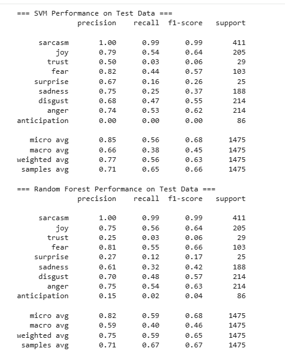
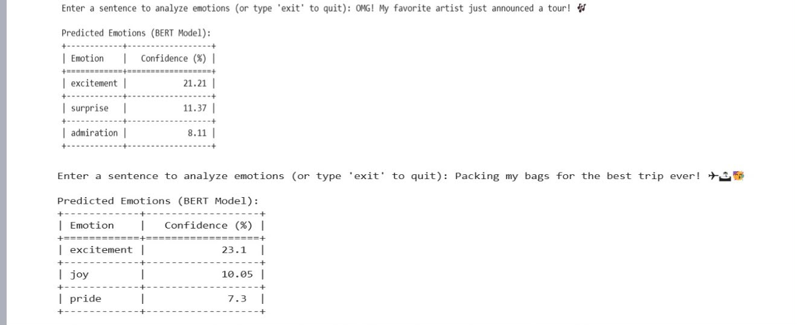

# Tweet Emotion Detection using Machine Learning and DistilBERT

## Overview

This project is a Tweet Emotion Detection System that analyzes the emotional content of tweets and predicts the emotions expressed in the text.

The project combines traditional Machine Learning techniques (TF-IDF, Support Vector Machine, and Random Forest) with a pre-trained Transformer model (DistilBERT trained on the GoEmotions dataset) to perform emotion classification.

The system identifies emotions such as:

- Joy
- Trust
- Fear
- Surprise
- Sadness
- Disgust
- Anger
- Anticipation
- Sarcasm

The final prediction is generated using a pre-trained DistilBERT model, while SVM and Random Forest models are trained and evaluated for comparison.

---

# Project Objectives

- Analyze emotional content in tweets.
- Apply Natural Language Processing (NLP) techniques.
- Convert text into numerical features using TF-IDF.
- Train and evaluate machine learning models.
- Use a Transformer-based model for contextual emotion detection.
- Display top predicted emotions with confidence scores.

---

# Dataset

## Dataset Type

Custom Tweet Emotion Dataset

## Description

The dataset contains tweets labeled with multiple emotion categories.

### Emotion Labels

- Sarcasm
- Joy
- Trust
- Fear
- Surprise
- Sadness
- Disgust
- Anger
- Anticipation

## Dataset Structure

Required columns:

```text
Tweet
sarcasm
joy
trust
fear
surprise
sadness
disgust
anger
anticipation
```

## Dataset Source

This dataset was created and prepared specifically for this project.

---

# Technologies Used

## Programming Language

- Python

## Libraries

- Pandas
- NumPy
- Scikit-learn
- Transformers (Hugging Face)
- PyTorch
- Emoji
- Tabulate

## Machine Learning Models

- Support Vector Machine (SVM)
- Random Forest Classifier

## NLP / Deep Learning Model

- DistilBERT
- GoEmotions Student Model

---

# Project Workflow

## Step 1: Data Loading

The dataset is loaded using Pandas.

```python
df = pd.read_csv("dataset.csv")
```

---

## Step 2: Data Validation

The project verifies that all required emotion label columns exist.

If any label column is missing:

- The column is automatically created.
- Missing values are replaced with 0.

---

## Step 3: Text Preprocessing

Each tweet undergoes preprocessing:

- Convert text to lowercase
- Remove URLs
- Remove user mentions
- Convert emojis into text labels
- Remove special characters

### Example

Input:

```text
I am excited 😊!!!
```

Output:

```text
i am excited smiling_face
```

---

## Step 4: Train-Test Split

The dataset is divided into:

- 80% Training Data
- 20% Testing Data

```python
train_test_split(
    test_size=0.2,
    random_state=42
)
```

---

## Step 5: Feature Extraction using TF-IDF

Machine Learning models cannot process raw text directly.

TF-IDF converts text into numerical vectors.

```python
TfidfVectorizer(
    max_features=2000,
    stop_words="english"
)
```

---

## Step 6: Model Training

### Support Vector Machine (SVM)

```python
OneVsRestClassifier(
    SVC(kernel="linear")
)
```

### Random Forest

```python
OneVsRestClassifier(
    RandomForestClassifier()
)
```

A One-vs-Rest strategy is used because a single tweet may contain multiple emotions simultaneously.

---

## Step 7: Model Evaluation

The models are evaluated using:

- Precision
- Recall
- F1 Score

```python
classification_report()
```

---

## Step 8: Transformer-Based Emotion Detection

A pre-trained DistilBERT model is loaded using Hugging Face Transformers.

```python
pipeline(
    "text-classification",
    model="joeddav/distilbert-base-uncased-go-emotions-student",
    top_k=None
)
```

The model generates confidence scores for multiple emotions.

---

## Step 9: Emotion Prediction

When the user enters a tweet:

```text
I am scared about tomorrow.
```

The system:

1. Preprocesses the text
2. Converts text into TF-IDF features
3. Predicts emotions using SVM
4. Predicts emotions using Random Forest
5. Predicts emotions using DistilBERT
6. Displays the top 3 emotions

### Sample Output

```text
+-------------+------------------+
| Emotion     | Confidence (%)   |
+-------------+------------------+
| fear        | 40.62            |
| disgust     | 13.59            |
| disapproval | 6.87             |
+-------------+------------------+
```

---

# Project Architecture

```text
Dataset
   │
   ▼
Data Validation
   │
   ▼
Text Preprocessing
   │
   ▼
Train-Test Split
   │
   ▼
TF-IDF Feature Extraction
   │
   ├──────────► SVM
   │
   └──────────► Random Forest
   │
   ▼
Model Evaluation
   │
   ▼
Pre-trained DistilBERT
   │
   ▼
Emotion Prediction
   │
   ▼
Top 3 Emotions with Confidence Scores
```

---

# Project Results

## Prediction Output



## Model Evaluation



---

# How to Run the Project

## Clone the Repository

```bash
git clone https://github.com/varshasri11/Tweet-Emotion-Detection.git
```

---

## Install Dependencies

```bash
pip install -r requirements.txt
```

---

## Open the Notebook

Using Jupyter Notebook:

```bash
jupyter notebook
```

OR

Open the notebook directly in Google Colab.

---

## Run All Cells

Execute all notebook cells sequentially.

When prompted, enter a tweet:

```text
I am nervous about my interview tomorrow.
```

---

# Project Folder Structure

```text
Tweet-Emotion-Detection
│
├── README.md
├── emotion_detection.ipynb
├── requirements.txt
├── dataset.csv
│
└── screenshots
    ├── output1.png
    └── output2.png
```

---

# Future Improvements

- Fine-tune DistilBERT on a custom emotion dataset.
- Build a Streamlit web application.
- Integrate real-time Twitter/X data.
- Create emotion visualization dashboards.
- Deploy the application on cloud platforms.

---

# Learning Outcomes

This project helped in understanding:

- Natural Language Processing (NLP)
- Text Preprocessing Techniques
- TF-IDF Feature Extraction
- Multi-Label Classification
- Support Vector Machines (SVM)
- Random Forest Classification
- Transformer Models
- DistilBERT
- Emotion Detection from Text

---

# Author

**Bantu Varsha Sri**

Computer Science Student  
Java | Python | Data Analytics | Machine Learning Enthusiast
